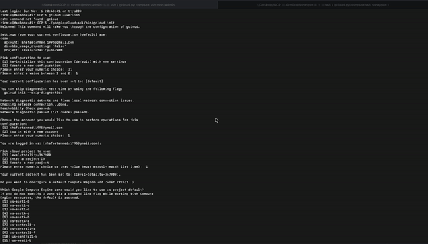

# Honeypot Assignment

**Time spent:** **10** hours spent in total

**Objective:** Create a honeynet using MHN-Admin. Present your findings as if you were requested to give a brief report of the current state of Internet security. Assume that your audience is a current employer who is questioning why the company should allocate anymore resources to the IT security team.

### MHN-Admin Deployment (Required)

**Summary:** How did you deploy it? Did you use GCP, AWS, Azure, Vagrant, VirtualBox, etc.?

- [x] I used the ```GCP```, after that i created the MHN Admin VM via. VM needs to have an internet-facing IP and accessible to you via SSH. After that i run the GCP Users Firewall Setup. 



### Dionaea Honeypot Deployment (Required)

**Summary:** Briefly in your own words, what does dionaea do?
- [x] Dionaea is a honeypot with little involvement that catches assault payloads and malware. Dionaea is intended to be a Nepenthes replacement, using Python as the software program, libemu to identify shellcodes, and support for IPv6 and TLS.


### Database Backup (Required) 

**Summary:** What is the RDBMS that MHN-Admin uses? What information does the exported JSON file record?
- [x] Ubuntu is the RDBMS that MHN-Admin uses. The exported JSON file record contains specific data on the nature of the attacks and where they came from such as the IP address, session ID, and such.

*Be sure to upload session.json directly to this GitHub repo/branch in order to get full credit.*
